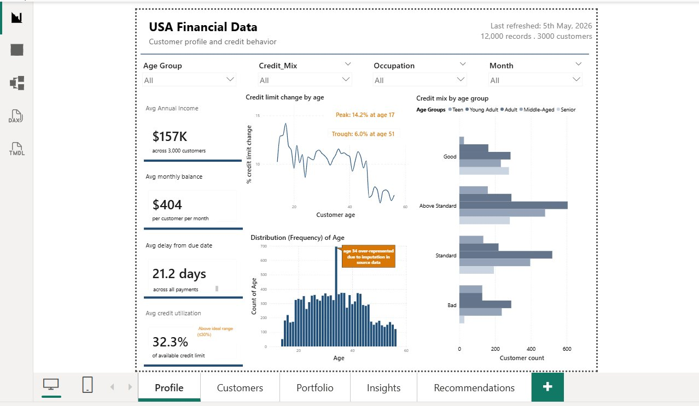
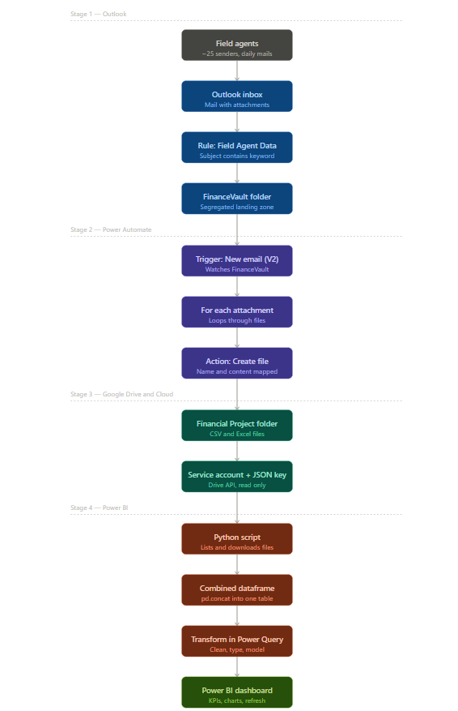
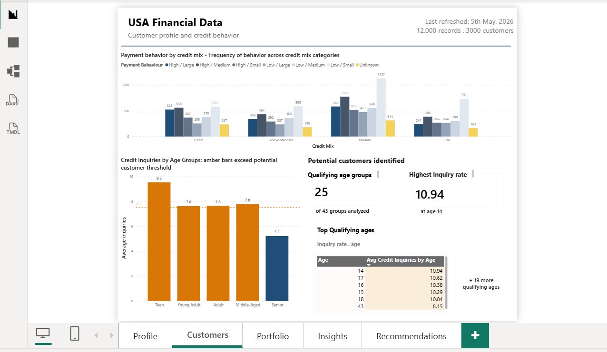
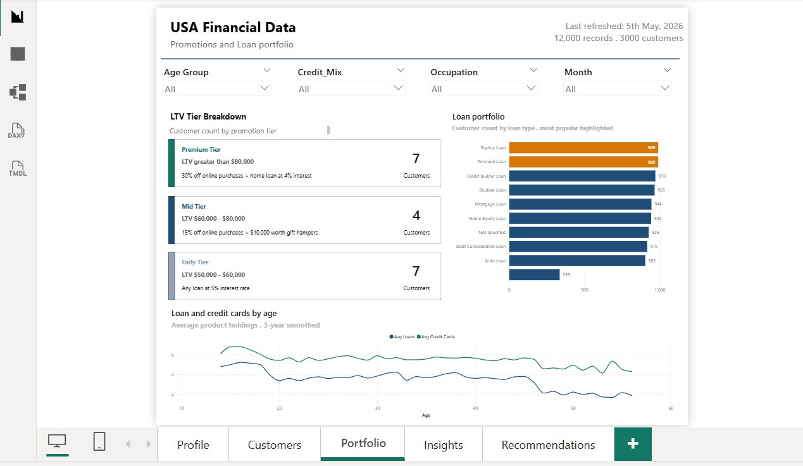
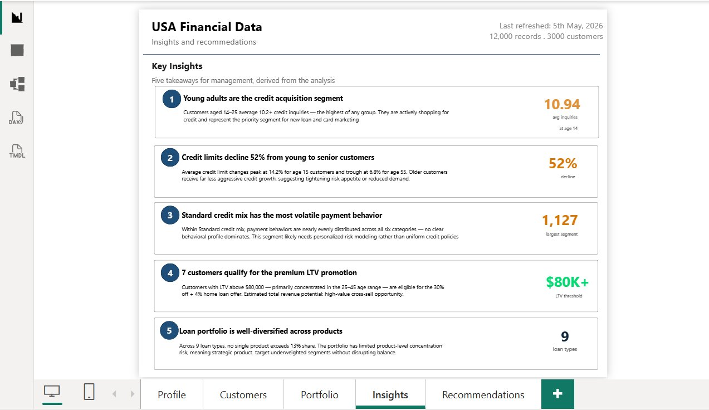
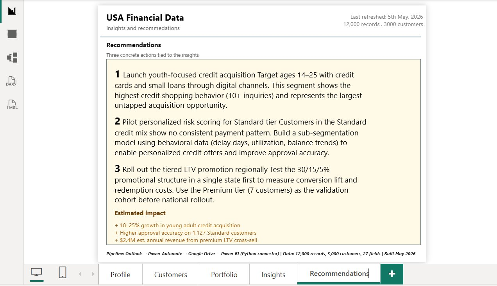

# USA Financial Data Pipeline & Dashboard

End-to-end automated data pipeline that ingests daily financial reports from 25 field agents via email, processes them through cloud services, and surfaces insights through a 5-page interactive Power BI dashboard. Eliminated ~$144K/year in manual processing costs and reduced report turnaround from 5 hours to 30 minutes.



## The problem

A financial analytics firm received ~25 attachments daily from field agents across the US. The manual workflow — download from email, combine files, clean data, build dashboard — took 5 hours per day, required two dedicated employees ($12K/month), and produced frequent errors that delayed insight delivery to the client.

## The solution

A four-stage pipeline that runs unattended:



1. **Outlook** receives mails. A rule routes attachments matching the keyword to a dedicated folder.
2. **Power Automate** monitors the folder, extracts attachments, and writes each one to Google Drive.
3. **Google Cloud service account** authorizes programmatic Drive access via the Drive API.
4. **Power BI** ingests the files via a Python script, combines them with pandas, and powers the dashboard.

## Tech stack

- **Microsoft Outlook** — entry point, rule-based mail routing
- **Microsoft Power Automate** — no-code workflow orchestration
- **Google Drive** — intermediate cloud storage
- **Google Cloud Console** — service account, IAM, Drive API
- **Python** — `google-auth`, `google-api-python-client`, `pandas`, `requests`
- **Power BI Desktop** — DAX measures, Power Query, custom theme
- **Power BI Python connector** — bridges Drive API output into the model

## Dashboard

Five pages, each answering a distinct business question:

| Page | Question answered |
|---|---|
| Profile | Who are our customers and how do they manage credit? |
| Customers | What payment behaviors and credit inquiries identify potential customers? |
| Portfolio | Which products are most popular and how do holdings change with age? |
| Insights | What are the five key takeaways from the analysis? |
| Recommendations | What concrete actions should the business take? |

### Page 1 — Profile (customer profile and credit behavior)

KPI cards on the left, credit-limit-by-age trend top-center, age distribution histogram bottom-center, credit-mix-by-age cluster chart on the right. Imputation bias on age 34 is flagged inline.


### Page 2 — Customers (payment behavior and potential customer identification)

Payment behavior by credit mix on top, credit inquiries threshold chart bottom-left, potential customer summary cards and top qualifying ages bottom-right.



### Page 3 — Portfolio (LTV tiers and loan distribution)

LTV tier breakdown cards (Premium/Mid/Entry), loan portfolio horizontal bar chart with most-popular highlighted, smoothed loans-and-credit-cards-by-age line chart at the bottom.



### Page 4 — Insights (five takeaways for management)

Numbered insight cards, each tied to a specific number from the dashboard. Color-coded supporting stats: amber for observations, teal for opportunities, navy for structural facts.



### Page 5 — Recommendations (concrete actions and projected impact)

Three numbered actions with explanations, plus an "Estimated impact" footer quantifying expected outcomes. Pipeline architecture noted at the bottom.



## Key DAX work

- **LTV Score calculation** with bucketed promotion tiers (Premium, Mid, Entry) using SWITCH and FILTER patterns
- **Threshold-based credit inquiry analysis** with conditional bar coloring driven by a measure
- **Rolling-window smoothing** on age-binned trend lines using context-manipulation DAX
- **Data quality wrappers** to handle non-numeric values (`Data Missing`) inline using `NOT(ISERROR(VALUE()))` patterns
- **Sort-by-column setup** for credit mix and age groups, with circular dependency resolved via Power Query

Full DAX library: [`powerbi/measures.dax`](powerbi/measures.dax)

## Data

- **Volume:** 12,000 records, 3,000 customers
- **Fields:** 27 attributes per record (demographics, credit history, payment behavior, loan portfolio)
- **Source:** Daily CSV/XLSX files from field agents (data not committed for privacy)
- **Schema:** [`data/sample_data_schema.md`](data/sample_data_schema.md)

## Insights surfaced

1. Customers aged 14–25 are the credit acquisition segment, averaging 10.2+ credit inquiries
2. Credit limit growth declines 52% from younger to older customers
3. Standard credit mix segment (1,127 customers) shows no clear behavioral pattern
4. 7 customers qualify for the premium LTV promotion tier (LTV > $80K)
5. Loan portfolio is well-diversified across 9 product types

Full analysis with supporting numbers is on the Insights page; resulting actions are on the Recommendations page.

## Repository structure

```
.
├── docs/                  Architecture and dashboard screenshots
├── pipeline/              Step-by-step setup guides for each stage
├── scripts/               Python ingestion script
├── powerbi/               DAX measures and data model documentation
└── data/                  Schema documentation (no real data)
```

## Recreating this pipeline

If you want to set up a similar pipeline:

1. Outlook rule setup → [`pipeline/outlook_rule_config.md`](pipeline/outlook_rule_config.md)
2. Power Automate flow → [`pipeline/power_automate_flow.md`](pipeline/power_automate_flow.md)
3. Google Cloud service account → [`pipeline/google_cloud_setup.md`](pipeline/google_cloud_setup.md)
4. Python ingestion script → [`scripts/drive_to_powerbi.py`](scripts/drive_to_powerbi.py)

## Challenges solved during the build

- **Imputation bias detection:** Identified that age 34 was over-represented by 90% vs surrounding ages (696 records vs ~370 average), indicating median-fill of missing values upstream. Filtered affected records from demographic visualizations and surfaced the issue inline on Page 1.
- **Circular dependency in DAX sort-by-column:** Resolved by moving order columns from calculated columns to Power Query custom columns.
- **Non-numeric values in numeric columns:** Wrapped affected DAX measures in error-tolerant patterns; later cleaned at the Power Query layer for performance.
- **Static annotations vs dynamic filtering:** Identified that hardcoded peak/trough labels would mislead users when filters were applied. Used `Edit interactions` to designate the credit-limit chart as a context visual that ignores slicers, maintaining annotation accuracy.

## License

MIT — see [LICENSE](LICENSE)

## Contact

Built by **Protoy Debroy**

If you want to discuss this project or related work, reach out via [LinkedIn](#) or email.
